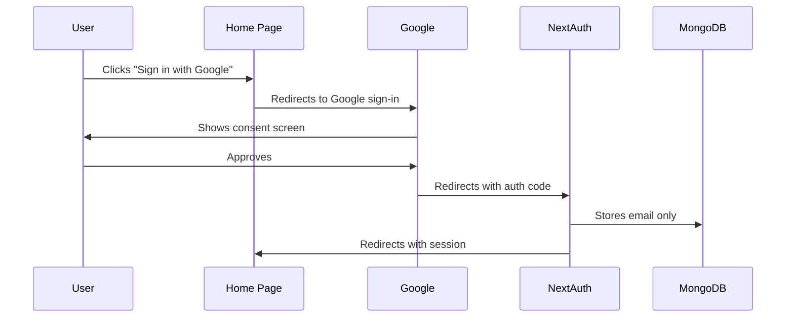

# Scoutly

A Next.js application for scraping and managing job listings with advanced anti-bot measures and MongoDB integration.

## Authentication Setup

### 1. Install Dependencies

```bash
npm install next-auth@latest @auth/core @auth/mongodb-adapter mongodb --legacy-peer-deps
```

### 2. Google OAuth Configuration

1. Go to [Google Cloud Console](https://console.cloud.google.com/)
2. Create a new project or select existing one
3. Navigate to "APIs & Services" > "Credentials"
4. Click "Create Credentials" > "OAuth client ID"
5. Choose "Web application"
6. Set authorized origins:
   ```
   http://localhost:3000
   ```
7. Set authorized redirect URIs:
   ```
   http://localhost:3000/api/auth/callback/google
   ```
8. Copy the generated Client ID and Client Secret

### 3. Environment Setup

1. Generate NEXTAUTH_SECRET:
   ```bash
   openssl rand -base64 32
   # or
   node -e "console.log(require('crypto').randomBytes(32).toString('base64'))"
   ```
2. Update .env file:
   ```
   NEXTAUTH_URL="http://localhost:3000"
   NEXTAUTH_SECRET="your-generated-secret"
   GOOGLE_CLIENT_ID="your-client-id"
   GOOGLE_CLIENT_SECRET="your-client-secret"
   ```

### Authentication Flow



## Getting Started

### Prerequisites

- Docker and Docker Compose
- Node.js 20+ (for local development)

### Quick Start

```bash
# Start containers
docker compose up -d

# Seed database
docker compose exec app npm run seed
```

Application: [http://localhost:3000](http://localhost:3000)

## API Endpoints

### Companies API

`GET /api/companies`

- Returns list of all companies

### Jobs API

`POST /api/jobs`

- Scrapes and processes job listings
- Supports custom selectors and filters

### Scrape API

`POST /api/scrape`

- Generic web scraping with anti-bot measures
- Supports progressive loading and fallbacks

## Development

### Commands

```bash
# View logs
docker compose logs -f

# Rebuild containers
docker compose up --build

# Reset environment
docker compose down -v
```

### Local Setup

1. Install dependencies: `npm install`
2. Configure environment: Copy `.env.example` to `.env`
3. Start development: `npm run dev`

## Project Structure

```
src/
├── app/          # Next.js app
├── components/   # React components
├── config/       # Configuration
├── models/       # Database models
├── services/     # Business logic
└── utils/        # Utilities
```
