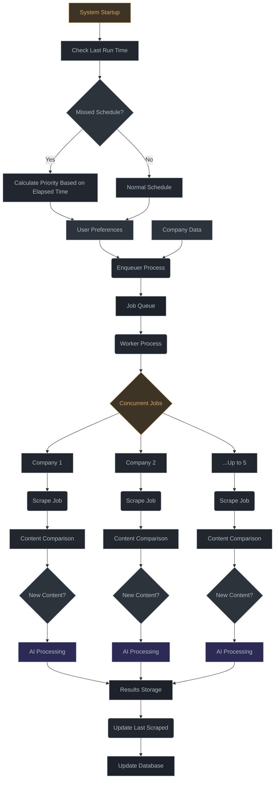

# Background Jobs Enhancement Plan

## Overview

This document outlines the plan to enhance the background jobs system for Scoutly to support user-configurable company tracking with prioritization. The system will initially be developed on laptop/desktop environments using anacron, and later deployed on a Raspberry Pi 5 using Cloudflare Tunnel, with the frontend hosted on Vercel.

## Current Architecture

The current background jobs implementation (outlined in `/TODOS/background-jobs.md`) provides:

1. A basic priority system (HIGH, MEDIUM, LOW)
2. A job queue managed by MongoDB
3. Producer-consumer pattern with:
   - Enqueuer script (cron-based producer)
   - Worker script (continuous consumer)
4. Docker integration

## Requirements for Enhancement

1. **User-Configurable Company Tracking**:

   - Users should be able to select which companies to track
   - Users should be able to assign custom rankings (1-100) to companies
   - Company ranking determines scraping frequency

2. **Scraping Frequency Requirements**:

   - High-priority companies (rank ≈ 100): Check at least once per day, maximum every 3 days
   - Low-priority companies (rank ≤ 5): Check less frequently while still respecting anti-bot measures

3. **System Constraints**:
   - Avoid triggering anti-bot measures on target websites
   - Minimize AI API usage due to free plan rate limits
   - Maintain incremental scraping (only process new links)
   - Process companies in batches based on available system resources
   - Support laptop/desktop environments initially, with Raspberry Pi as final deployment target
   - Handle intermittent availability (system not always on)

## Detailed Implementation Plan

### 1. Database Schema Extensions

#### 1.1 Enhanced Company Model

**Note: Many of these fields are already implemented in the current model. This section documents the complete requirements for clarity.**

The existing `Company` model should have:

- Granular ranking system (1-100) instead of HIGH/MEDIUM/LOW
- Last scrape timestamp tracking
- Problem tracking fields
- Success/failure metrics

#### 1.2 User Company Preferences Model

Create a new model to track user preferences for companies:

- User-company relationship
- User-assigned rank (1-100)
- Tracking status (boolean)

### 2. Dynamic Scheduling Algorithm

#### 2.1 Rank-Based Scheduling

Implement a sliding scale for determining scrape frequency:

- Ranks 81-100: Every 24 hours (high priority)
- Ranks 61-80: Every 48 hours (2 days)
- Ranks 31-60: Every 72 hours (3 days)
- Ranks 11-30: Every 96 hours (4 days)
- Ranks 1-10: Every 120 hours (5 days, low priority)

#### 2.2 Anti-Bot Protection Measures

Implement variable delays and randomization:

- Randomized time between requests
- Variable browser fingerprints
- Progressive backoff for problematic sites
- Automatic circuit breakers for sites with repeated failures

### 3. Batch Processing Optimization

#### 3.1 Parallel Processing (Raspberry Pi Optimized)

- Process up to 5 companies concurrently (reduced from 10 due to Raspberry Pi constraints)
- Implement semaphores to manage browser instances (limit to 1-2)
- Add intelligent batching based on estimated processing time and resource usage
- Implement CPU/memory monitoring to dynamically adjust concurrency

#### 3.2 Content Comparison Optimization

- Build on existing link comparison functionality
- Focus primarily on links extraction and comparison (already implemented)
- Store minimal HTML necessary for link extraction
- Use efficient comparison algorithms optimized for link detection

### 4. Anacron-Based Scheduling System

#### 4.1 Intermittent Job Scheduling

- Implement anacron-compatible job scheduling for systems that aren't always on
- Create startup script to check for missed job periods
- Implement job progress persistence to handle interrupted scraping
- Design job scheduling based on time passed since last successful run
- Add system idle detection to prevent resource contention

#### 4.2 User Interface for Company Management

- Grid/list view of available companies
- Toggles for enabling/disabling tracking
- Drag-and-drop or slider for ranking assignment
- Sorting and filtering options

#### 4.3 Simplified Monitoring Dashboard

- Display critical logs and notifications in UI
- Show problematic companies with error details
- Focus on actionable insights rather than comprehensive analytics
- Provide direct links to take action on failing companies

### 5. Raspberry Pi Deployment Optimizations

#### 5.1 Resource Management

- Memory limit configuration optimized for 8GB RAM
- Browser cleanup routines
- NVMe SSD optimization for database operations
- Temperature monitoring and fan speed control
- Proactive cache management for optimal performance

#### 5.2 Cloudflare Tunnel Integration

- Secure external access configuration
- Health check endpoints
- Status dashboard

### 6. Fault Tolerance Enhancements

#### 6.1 Error Recovery

- Implement exponential backoff for failed scrapes
- Add automatic retry with different browser configurations
- Implement quarantine system for persistently problematic sites

#### 6.2 Notification and Self-Healing

- Add system monitoring
- Implement automatic restarts
- Create developer notification system for critical failures
- Provide email/push notifications for problematic companies
- Log problematic sites to a dedicated "needs attention" collection

## Implementation Phases

### Phase 1: Database Schema Extensions

1. Update Company model with expanded ranking field
2. Create UserCompanyPreference model
3. Create migration scripts for existing data
4. Update associated service methods

### Phase 2: Scheduling Algorithm Implementation

1. Implement dynamic scheduling utility
2. Update enqueuer script to use new algorithm
3. Add anti-bot protection measures
4. Test with various company configurations

### Phase 3: Batch Processing Optimization

1. Modify worker script for parallel processing
2. Implement semaphore system for browser management
3. Add content comparison optimization
4. Test with simulated workloads

### Phase 4: User Interface Development

1. Create company management dashboard
2. Implement drag-and-drop ranking interface
3. Add critical logs and notifications UI
4. Implement problematic companies dashboard
5. Integrate with backend APIs

### Phase 5: Anacron Implementation for Intermittent Systems

1. Implement anacron-based scheduling for laptops/desktops
2. Create scripts to detect system startup and trigger jobs
3. Design job state persistence for interrupted operations
4. Implement catch-up logic for missed time periods

### Phase 6: Deployment Configuration

1. Create Raspberry Pi optimized Docker configuration
2. Implement Cloudflare Tunnel setup
3. Add monitoring and health checks
4. Create deployment documentation

## Success Metrics

- System should handle 200+ tracked companies
- No more than 1% failed scrapes due to anti-bot detection
- AI API usage remains under free tier limits
- Job discovery latency meets ranking expectations
- CPU/memory usage stays within Raspberry Pi 5 capabilities (8GB RAM)
- Successful operation during daily laptop usage without noticeable performance impact
- Seamless migration from development to production environment

## Considerations and Best Practices

### Rate Limiting and Fair Use

- Implement courtesy delays between requests to the same domain
- Add automatic rate limiting based on domain response behavior
- Honor robots.txt where available
- Implement user-agent respect hierarchy

### Monitoring and Logging

- Add structured logging for all scraping activities
- Implement developer notification system
- Prioritize critical logs in UI dashboard
- Set up alerts for problematic companies and system failures
- Create notification channels (email/push) for critical issues

### Scaling Considerations

- Design system to scale horizontally if needed
- Allow for future worker distribution
- Implement database indexing for performance

## Diagram: Background Jobs System Flow

## Laptop/Desktop to Raspberry Pi Migration Plan

1. **Development Phase (Laptop/Desktop)**
   - Implement and test with anacron-based scheduling
   - Use system startup triggers and idle detection
   - Focus on robustness with interrupted operations
2. **Migration Phase**
   - Export job state and configuration
   - Setup Raspberry Pi environment
   - Transition from anacron to traditional cron
3. **Production Phase (Raspberry Pi)**
   - Implement continuous operation optimizations
   - Enable Cloudflare Tunnel
   - Setup monitoring for 24/7 operation

## Raspberry Pi Hardware Specifications

### Selected Hardware Components

1. **Main Board**:

   - Raspberry Pi 5 (8GB Model)
   - Provides excellent multi-threading capabilities for concurrent scraping

2. **Power & Cooling**:

   - Official 27W USB-C Power Supply for Raspberry Pi 5
   - Case with integrated active cooling fan
   - Essential for maintaining stable performance during extended scraping sessions

3. **Storage Solution**:
   - NVMe SSD PCIe Adapter (HAT/Base) - Pimoroni NVMe Base or Pineberry Pi HatDrive
   - NVMe M.2 SSD (256GB)
   - 32GB Class 10/A1 microSD Card (boot only)
   - Optimized for database performance and reduced I/O bottlenecks

## Future Enhancements

- Proxy rotation for high-priority companies
- Machine learning for optimal scrape frequency prediction
- Advanced content change detection algorithms
- Distributed worker system for multi-node deployment
- Synchronization between laptop and Raspberry Pi environments
