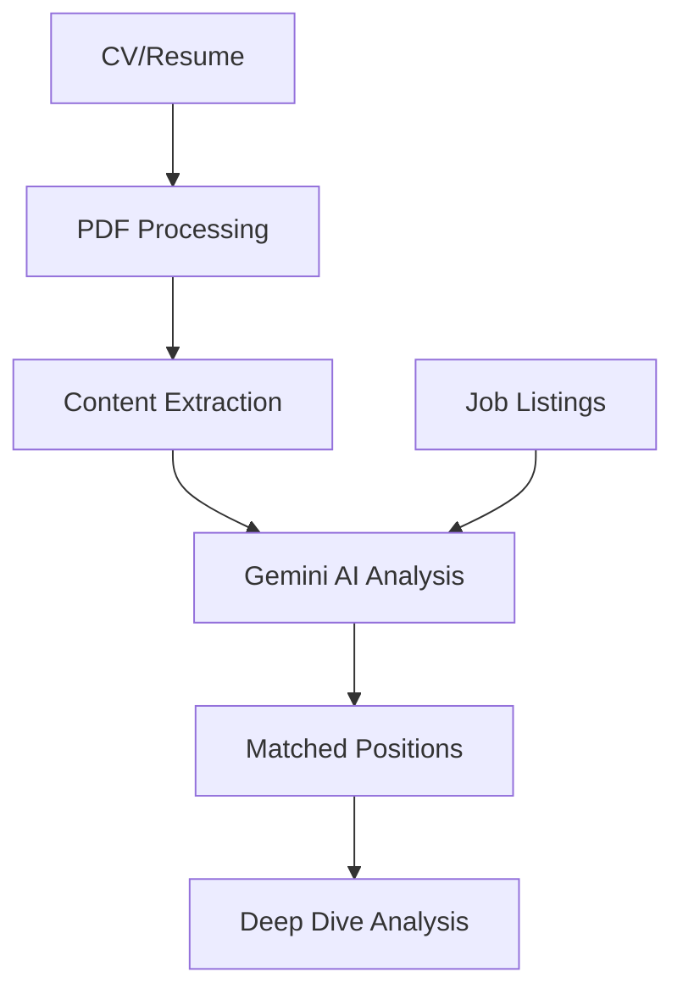

# Gemini AI Integration

## Overview

The Gemini AI integration provides intelligent job matching capabilities using Google's Generative AI model. The system consists of two main components:

1. `gemini.ts` - Core integration and job matching logic
2. `geminiSchemas.ts` - Type definitions and schema structures for AI interactions

## Main Features

- CV content extraction and analysis
- Job position matching against CV content
- Structured response handling through function calling
- Deep dive analysis of job postings
- Safety settings and error handling

## Architecture



## Configuration

### Model Setup

```typescript
const model = genAI.getGenerativeModel({
	model: 'gemini-2.0-flash',
	safetySettings: [
		{
			category: HarmCategory.HARM_CATEGORY_HATE_SPEECH,
			threshold: HarmBlockThreshold.BLOCK_ONLY_HIGH,
		},
	],
	tools: [{functionDeclarations: [matchPositionsSchema]}],
});
```

### Schema Definitions

#### Initial Matching Schema

```typescript
export const initialMatchingSchema: Schema = {
	type: SchemaType.OBJECT,
	properties: {
		recommendedPositions: {
			type: SchemaType.ARRAY,
			description:
				'A list of job positions that are a potential good fit for the candidate',
			items: {
				type: SchemaType.OBJECT,
				properties: {
					title: {type: SchemaType.STRING},
					url: {type: SchemaType.STRING},
				},
				required: ['title', 'url'],
			},
		},
	},
	required: ['recommendedPositions'],
};
```

#### Deep Dive Schema

The deep dive schema provides detailed analysis of job positions, including:

- Position details (title, location, timezone)
- Salary information
- Technical requirements
- Language requirements
- Visa/relocation information
- Fit analysis and scoring

## Core Functions

### PDF Processing

```typescript
async function processPDF(pdfUrl: string): Promise<string>;
```

- Handles PDF document retrieval and text extraction
- Supports both direct URLs and Google Drive links
- Returns structured CV content

### Position Matching

```typescript
export async function findMatchingPositions(
	links: ExtractedLink[],
	cvUrl: string,
): Promise<Array<MatchedPosition>>;
```

- Analyzes CV content against job positions
- Uses AI to evaluate technical fit and experience match
- Returns array of suitable positions

## Response Interfaces

### MatchedPosition

```typescript
export interface MatchedPosition {
	title: string;
	url: string;
}
```

### Deep Dive Analysis Results

```typescript
interface AnalysisResult {
	title: string;
	url: string;
	location?: string;
	timezone?: string;
	salary?: {
		min: number;
		max: number;
		currency: string;
		period: string;
	};
	techStack: string[];
	experienceLevel: string;
	languageRequirements: string[];
	visaSponsorshipOffered: boolean;
	relocationAssistanceOffered: boolean;
	goodFitReasons: string[];
	considerationPoints: string[];
	stretchGoals: string[];
	suitabilityScore: number;
}
```

## Usage Examples

### Basic Position Matching

```typescript
import {findMatchingPositions} from './utils/gemini';

const matches = await findMatchingPositions(
	jobLinks,
	'https://example.com/candidate-cv.pdf',
);

console.log('Matched positions:', matches);
```

### Deep Dive Analysis

```typescript
// Initialize model with deep dive schema
const model = genAI.getGenerativeModel({
	model: 'gemini-2.0-flash',
	tools: [{functionDeclarations: [deepDiveSchema]}],
});

// Analyze specific position
const analysis = await analyzePosition(jobUrl, cvContent);
```

## Error Handling

The integration includes robust error handling for common scenarios:

1. Invalid PDF URLs

```typescript
try {
	const cvContent = await processPDF(cvUrl);
} catch (error) {
	logger.error('CV processing failed:', error);
	// Handle invalid URL or processing failure
}
```

2. AI Model Errors

```typescript
try {
	const matches = await findMatchingPositions(links, cvUrl);
} catch (error) {
	logger.error('Position matching failed:', error);
	return []; // Return empty array on failure
}
```

## Best Practices

1. **CV Processing**

   - Always validate PDF URLs before processing
   - Handle both direct and Google Drive URLs
   - Implement retry logic for transient failures

2. **Position Matching**

   - Provide clear context in AI prompts
   - Include relevant sections of job descriptions
   - Set appropriate temperature for deterministic results

3. **Response Handling**
   - Validate all AI responses against schemas
   - Handle partial matches gracefully
   - Implement fallback logic for failed analyses

## Performance Considerations

1. **Batch Processing**

   - Group similar job positions for batch analysis
   - Implement rate limiting for API calls
   - Cache processed CV content when possible

2. **Resource Usage**
   - Monitor token usage for API cost control
   - Implement timeouts for long-running operations
   - Use streaming responses for large result sets

## Safety and Validation

1. **Input Validation**

   - Sanitize all user-provided URLs
   - Validate PDF content before processing
   - Implement size limits for documents

2. **AI Safety Settings**
   - Configure appropriate safety thresholds
   - Monitor and log safety violations
   - Implement content filtering if needed

## Troubleshooting

Common issues and solutions:

1. **PDF Processing Failures**

   - Check URL accessibility
   - Verify PDF format compatibility
   - Check file size limits

2. **Position Matching Issues**

   - Verify CV content extraction
   - Check job description format
   - Review AI prompt structure

3. **Integration Errors**
   - Verify API key configuration
   - Check network connectivity
   - Review rate limit status

## Monitoring and Logging

The integration uses the Logger utility for comprehensive monitoring:

```typescript
const logger = new Logger('GeminiAI');

// Track important operations
logger.info('Processing CV from URL:', {url: cvUrl});
logger.debug('Analyzing job positions:', {count: links.length});
logger.error('AI processing failed:', error);
```

Monitor key metrics:

- Response times
- Success/failure rates
- Token usage
- Match quality scores
