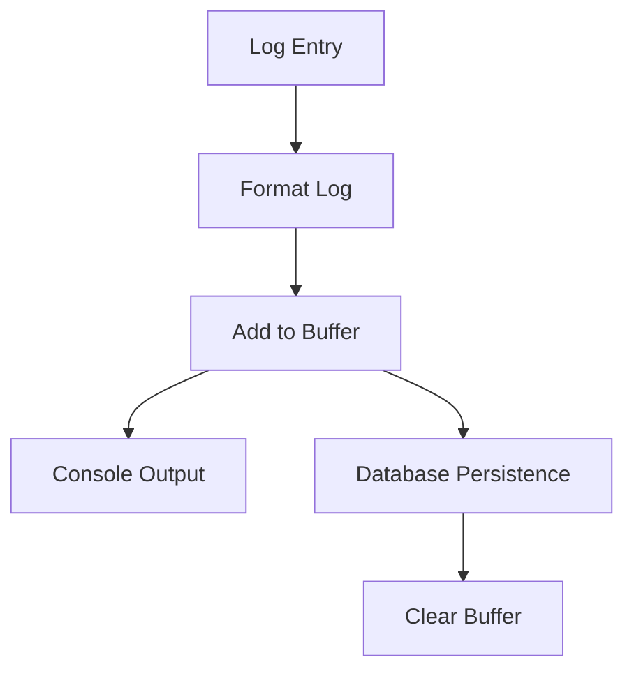

# Logger Utility

## Overview

The Logger utility provides a flexible, feature-rich logging system with support for:

- Multiple log levels (debug, info, warn, error, success)
- Contextual logging with emoji support
- Stack trace information
- Log buffering and database persistence
- Colorized console output
- Timestamp formatting

## Usage

### Basic Setup

```typescript
import {Logger} from './logger';

// Create a logger instance with context
const logger = new Logger('MyComponent');

// Create a logger with custom options
const logger = new Logger('MyComponent', {
	emoji: true,
	timestamp: true,
	color: true,
	stackDepth: 1,
});
```

### Logging Methods

```typescript
// Basic logging
logger.debug('Debug message');
logger.info('Info message');
logger.warn('Warning message');
logger.error('Error message');
logger.success('Success message');

// Logging with additional data
logger.info('Processing user data', {userId: '123', action: 'update'});

// Error logging with Error object
try {
	// ... some code
} catch (error) {
	logger.error('Operation failed', error);
}
```

## Configuration

### LogOptions Interface

```typescript
interface LogOptions {
	emoji?: boolean; // Enable/disable emoji in logs (default: true)
	timestamp?: boolean; // Include timestamps (default: true)
	prefix?: string; // Add a custom prefix to all logs
	color?: boolean; // Enable/disable colored output (default: true)
	stackDepth?: number; // How many stack frames to include (default: 1)
}
```

### Default Options

```typescript
{
  emoji: true,
  timestamp: true,
  color: true,
  stackDepth: 1
}
```

## Log Buffering and Persistence

The logger implements a buffering system that collects logs before persisting them to the database. This helps reduce database load and improve performance.

### Buffer Management

```typescript
// Logs are automatically buffered
logger.info('This is buffered');

// Manually save buffered logs to the database
await logger.saveBufferedLogs();
```

## Emoji Mappings

Each log level has an associated emoji for better visual identification:

- 🔍 Debug
- ℹ️ Info
- ⚠️ Warning
- ❌ Error
- ✅ Success

## Best Practices

1. **Contextual Naming**

   ```typescript
   // Good - Clear context
   const logger = new Logger('UserAuthService');

   // Avoid - Too generic
   const logger = new Logger('Service');
   ```

2. **Appropriate Log Levels**

   ```typescript
   // Debug - Detailed information for debugging
   logger.debug('Parsing user input', {input});

   // Info - General operational messages
   logger.info('User login successful');

   // Warning - Potential issues that don't stop execution
   logger.warn('Rate limit threshold approaching');

   // Error - Critical issues that need attention
   logger.error('Database connection failed');

   // Success - Successful completion of important operations
   logger.success('Backup completed successfully');
   ```

3. **Structured Data Logging**

   ```typescript
   // Good - Structured, searchable data
   logger.info('User action', {
   	userId: '123',
   	action: 'purchase',
   	amount: 99.99,
   });

   // Avoid - Unstructured string concatenation
   logger.info('User 123 made a purchase for 99.99');
   ```

## Error Handling

The logger handles errors gracefully and includes stack traces automatically:

```typescript
try {
	throw new Error('Something went wrong');
} catch (error) {
	logger.error('Operation failed', error);
	// Automatically includes stack trace and error details
}
```

## Clean Up

The logger automatically handles cleanup of buffered logs when the process exits:

- Saves any remaining buffered logs
- Clears the buffer
- Releases any resources

## Performance Considerations

1. **Buffer Size**: Logs are buffered in memory before being persisted. Monitor memory usage if generating high volumes of logs.

2. **Stack Depth**: Higher `stackDepth` values increase overhead. Use the minimum depth needed for your use case.

3. **Database Writes**: Logs are batch-written to reduce database load. Consider the `saveBufferedLogs()` frequency in high-traffic scenarios.

## Internal Architecture

The logger uses a layered approach:

1. Log creation and formatting
2. In-memory buffering
3. Console output with formatting
4. Asynchronous database persistence

### Log Flow


