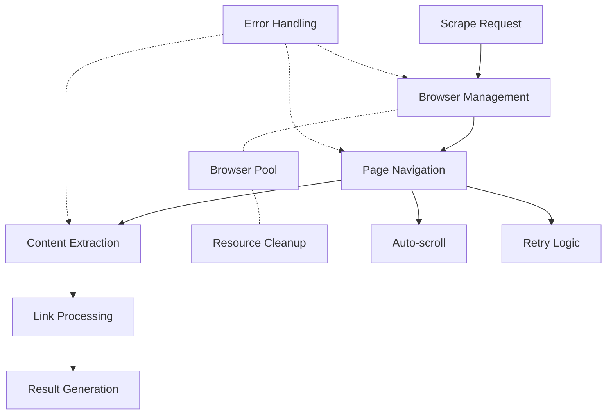

# Web Scraper Utility

## Overview

The Web Scraper utility provides a robust, production-grade web scraping solution using Playwright. It includes:

- Concurrent browser instance management
- Sophisticated retry logic
- Resource cleanup
- Link extraction and context gathering
- Comprehensive error handling

## Architecture



## Core Interfaces

### ScrapeRequest

```typescript
interface ScrapeRequest {
	url: string;
	options?: {
		timeout?: number;
		waitUntil?: 'domcontentloaded' | 'load' | 'networkidle';
	};
}
```

### ExtractedLink

```typescript
interface ExtractedLink {
	url: string;
	text: string;
	title?: string;
	context: string;
	isExternal: boolean;
}
```

### ScrapeResult

```typescript
interface ScrapeResult {
	content: string;
	links: ExtractedLink[];
	error?: string;
	metadata?: {
		title?: string;
		description?: string;
		url: string;
		scrapedAt: string;
	};
}
```

## Browser Management

### Configuration

```typescript
const MAX_BROWSERS = 3;
const DEFAULT_TIMEOUT = 60000; // 60s
const EXTENDED_TIMEOUT = 120000; // 120s
const MAX_LOAD_TIME = 300000; // 5m absolute maximum
```

### Browser Options

```typescript
const browserOptions = {
	headless: true,
	executablePath: '/usr/bin/chromium-browser',
	args: [
		'--no-sandbox',
		'--disable-setuid-sandbox',
		'--disable-dev-shm-usage',
		'--disable-web-security',
		'--disable-features=VizDisplayCompositor',
	],
};
```

## Usage

### Basic Scraping

```typescript
import {scrapeWebsite} from './utils/scraper';

const result = await scrapeWebsite({
	url: 'https://example.com',
	options: {
		timeout: 30000,
		waitUntil: 'networkidle',
	},
});

console.log('Scraped content:', result.content);
console.log('Extracted links:', result.links);
```

### With Company Information

```typescript
import type {ICompany} from '../models/Company';

const company: ICompany = {
	name: 'Example Corp',
	// ... other company fields
};

const result = await scrapeWebsite(
	{url: 'https://example.com/careers'},
	company,
);
```

## Features

### 1. Retry Logic

- Maximum retries: 5
- Exponential backoff
- Different loading strategies

```typescript
const WAIT_STRATEGIES = ['networkidle', 'load', 'domcontentloaded'] as const;
```

### 2. Auto-scrolling

Automatically scrolls pages to load lazy content:

```typescript
async function autoScroll(page: playwright.Page) {
	// Scrolls in 100px increments
	// Maximum 30 scrolls
	// 100ms delay between scrolls
}
```

### 3. Link Extraction

- Gets full URLs from relative paths
- Determines external/internal links
- Extracts surrounding context
- Cleans and normalizes text

### 4. Resource Management

- Semaphore for browser instances
- Automatic cleanup on process exit
- Memory leak prevention
- Resource release handling

## Error Handling

### Retry Scenarios

```typescript
const MIN_RETRY_DELAY = 2000; // 2s
const MAX_RETRY_DELAY = 30000; // 30s

// Exponential backoff with jitter
const delay = Math.min(
	MIN_RETRY_DELAY * Math.pow(2, retryCount),
	MAX_RETRY_DELAY,
);
```

### Error Types

1. **Navigation Errors**

   - Timeout errors
   - Network failures
   - Invalid URLs

2. **Content Extraction Errors**

   - Empty content
   - Malformed HTML
   - Missing elements

3. **Browser Errors**
   - Launch failures
   - Resource exhaustion
   - Context creation errors

## Best Practices

### 1. Resource Management

```typescript
try {
	// Acquire browser instance
	await acquireBrowser();
	// Perform scraping
} finally {
	// Always release resources
	releaseBrowser();
}
```

### 2. URL Handling

```typescript
function getFullUrl(href: string, baseUrl: string): string {
	try {
		if (href.startsWith('//')) {
			href = new URL(baseUrl).protocol + href;
		}
		return new URL(href, baseUrl).toString();
	} catch {
		return '';
	}
}
```

### 3. Context Extraction

```typescript
function extractContext($elem: cheerio.Cheerio): string {
	// Get preceding text
	const prevText = getPrecedingText($elem);
	// Get following text
	const nextText = getFollowingText($elem);
	// Combine and clean
	return cleanText(prevText + linkText + nextText);
}
```

## Performance Optimization

### Browser Pool Management

- Limit concurrent browsers
- Reuse browser instances
- Graceful cleanup

### Memory Management

- Clear page contexts after use
- Regular garbage collection
- Resource monitoring

### Request Optimization

- Smart retry strategies
- Concurrent request limits
- Response caching when appropriate

## Monitoring

The scraper uses the Logger utility for comprehensive monitoring:

```typescript
const logger = new Logger('Scraper');

// Track operations
logger.info('Starting scrape operation for URL:', {url});
logger.debug('Browser launched successfully');
logger.error('Scraping error:', error);
```

### Key Metrics to Monitor

- Successful scrapes
- Retry rates
- Error frequencies
- Resource usage
- Response times

## Troubleshooting

### Common Issues

1. **Timeout Errors**

   - Increase timeout values
   - Check network conditions
   - Verify site responsiveness

2. **Memory Issues**

   - Monitor browser instances
   - Check concurrent scrapes
   - Verify cleanup procedures

3. **Content Extraction Failures**
   - Verify selectors
   - Check page structure
   - Monitor site changes

### Debug Mode

```typescript
const logger = new Logger('Scraper', {
	level: 'debug',
	prefix: '[Scraper]',
});
```

## Safety Considerations

1. **Rate Limiting**

   - Implement delays between requests
   - Monitor site-specific limits
   - Use exponential backoff

2. **Resource Protection**

   - Limit concurrent browsers
   - Implement timeouts
   - Monitor memory usage

3. **Error Recovery**
   - Graceful degradation
   - Automatic cleanup
   - State recovery
